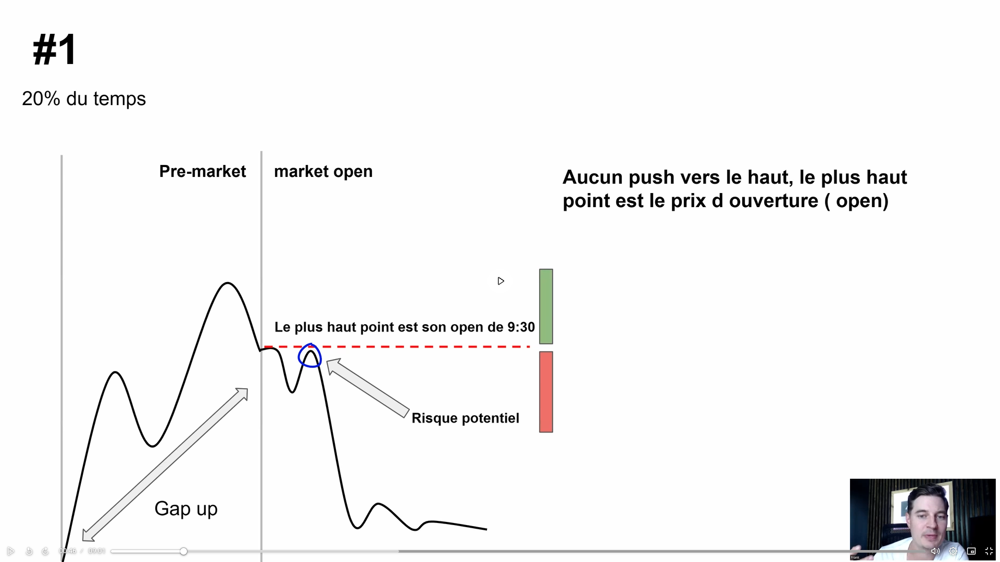
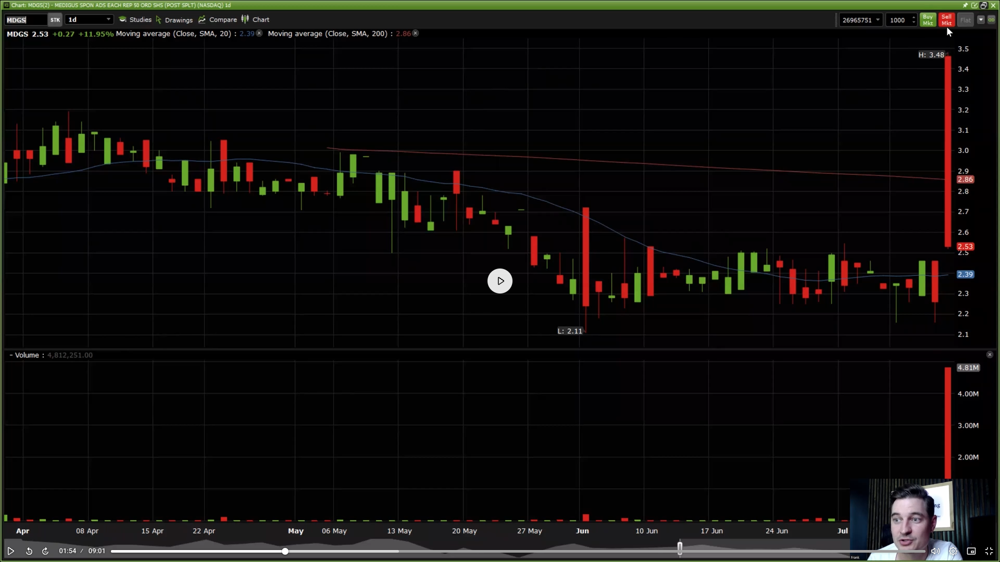
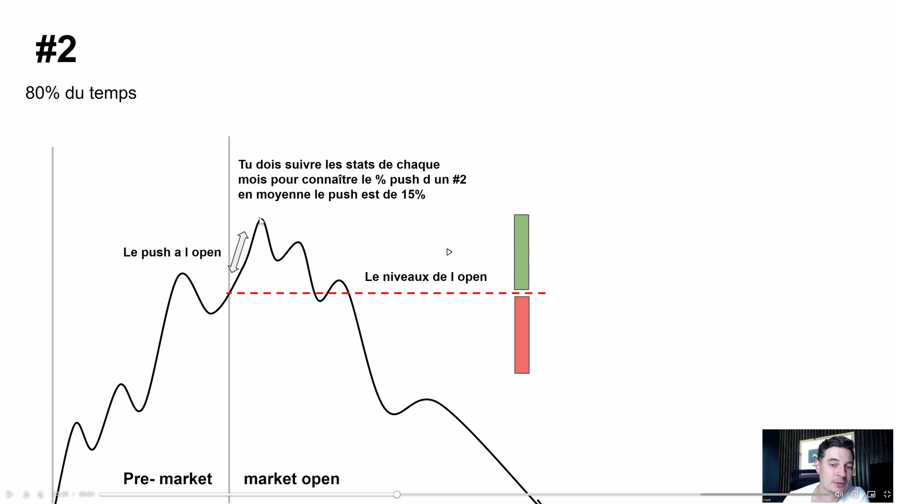
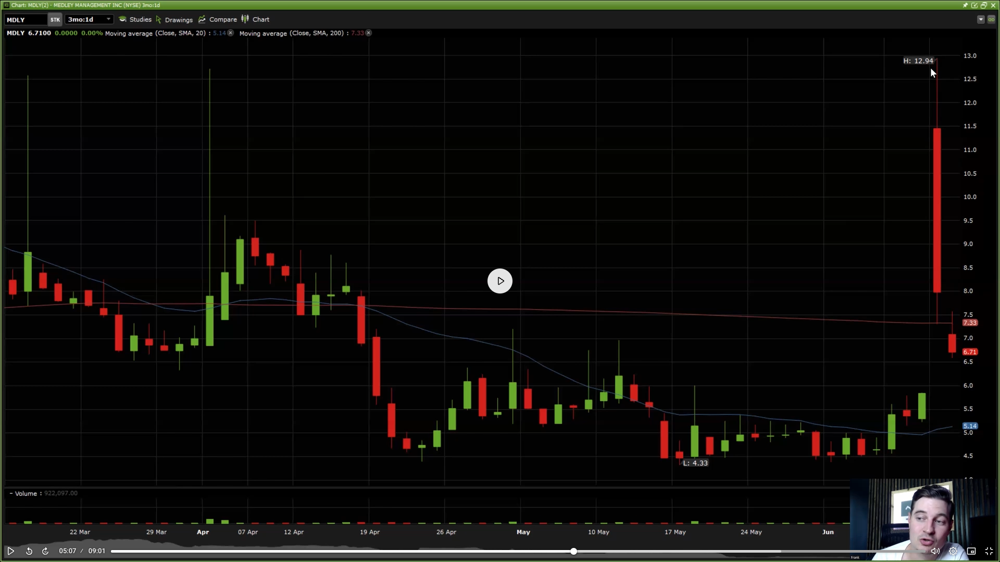
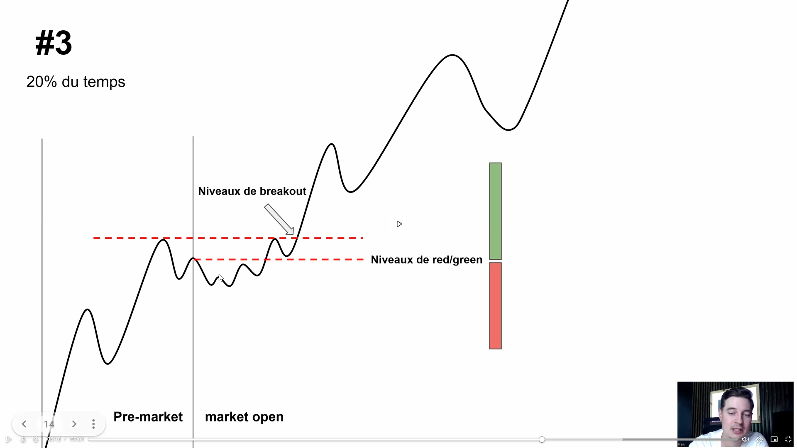
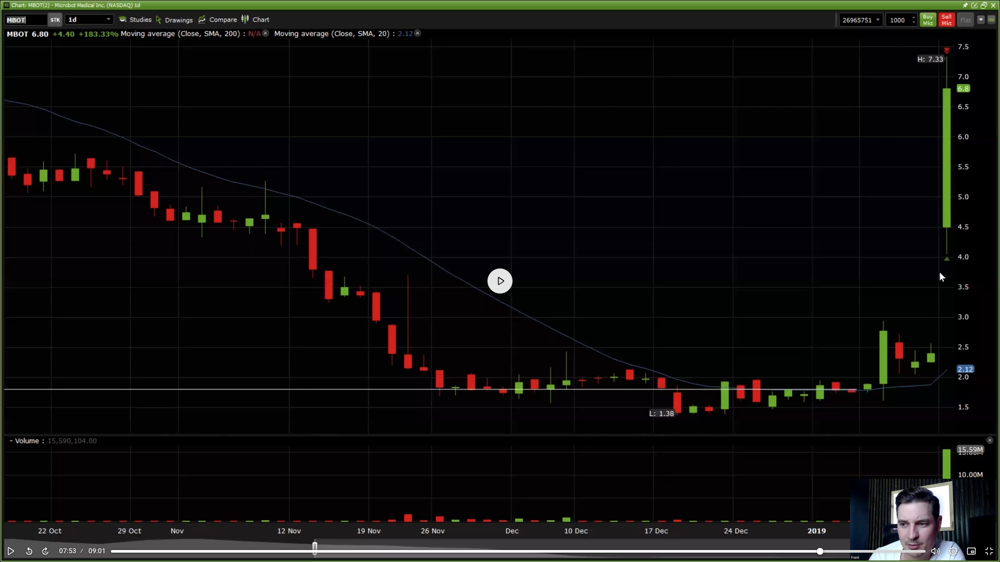

# 3 patterns d'ouverture sur gap up — fiche de révision

> Quand un titre matche la checklist [pattern](../check-company.md) — gap up sans fundamental, float dans la zone, *bad company* —, l'ouverture du marché (9:30 ET) joue **un de ces trois scénarios**. Mémoriser les trois archétypes te dit où entrer, comment, et quand t'écarter.

---

## Distribution probabiliste

Sur l'ensemble des gap ups qui matchent la checklist :

| Probabilité | Pattern | Action par défaut |
|-------------|---------|-------------------|
| ~16 % | **n°1 — Drop direct à l'open** | Short |
| ~64 % | **n°2 — Push puis retombe (~15 min)** | Short |
| ~20 % | **n°3 — Green Day** | **No go** (5 % tradables en long — hors périmètre actuel) |

> **Le gap up se corrige ~80 % du temps.** Le terrain de jeu vit sur les patterns 1 et 2 ; le pattern 3 n'a un setup utile que sur sa minorité.

---

## Pattern n°1 — Drop direct à l'open

*Théorie* — 
*Exemple* — 

À l'ouverture, le titre **tombe immédiatement**.

**Mécanique** — les acheteurs premarket entrent en pariant sur la continuation du push. Dès que le cours s'inverse, ils paniquent et liquident → cascade de ventes qui amplifie la chute.

### Entrée

Il faut **anticiper le drop**, sinon on rate le mouvement. La forme à reconnaître **avant l'open** :

1. Le cours monte en premarket → forme un sommet (*peak*).
2. Il commence à redescendre → l'inversion dessine un V.
3. On entre **à l'open**, juste avant la chute principale.

**Pas de V au premarket → pas de pattern n°1.** On bascule sur le pattern n°2.

---

## Pattern n°2 — Push puis retombe

*Théorie* — 
*Exemple* — 

Le titre **continue de monter à l'open** (*push*) malgré la mauvaise *company*. La descente arrive **dans les 15 minutes** suivantes.

**Mécanique** — les *retail buyers* d'ouverture épuisent leur munition, et la qualité réelle de l'entreprise reprend le dessus. Le retour à la baisse est plus tardif que sur le n°1 mais tout aussi prévisible.

### Entrée

Attendre la confirmation du *peak* post-open puis entrer **sur le rejet**. La fenêtre des ~15 minutes laisse plus de marge que le n°1 — on n'a pas besoin de timer l'open à la seconde.

---

## Pattern n°3 — Green Day

*Théorie* — 
*Exemple* — 

Le titre **reste vert toute la journée**. Le gap up n'a pas été corrigé.

**No go par défaut** — la thèse short est invalidée et la stratégie long n'est pas (encore) posée.

### Cas tradable

Sur les ~20 % de gap ups verts, seulement **5 % sont de vraies grosses journées vertes** intéressantes pour du long (≈ 1 % de l'univers global gap up). À détecter mais **hors périmètre** tant que les critères d'entrée long ne sont pas définis.

---

## Mémo de poche

```
n°1   ~16 %   Drop au open       → V au premarket, entrée à l'open
n°2   ~64 %   Push puis drop     → entrée sur rejet dans les 15 min
n°3   ~20 %   Green Day          → No go (5 % long, à creuser)
```

**Hypothèse de base : short.** Pattern 3 → on s'écarte, pas de long sans signal explicite.

---

## À creuser

- **Signal de fin de push** sur le pattern 2 — volume, structure de chandelle — pour éviter d'entrer trop tôt sur un faux *peak*.
- **Critères d'entrée long** sur le pattern 3 — récupérer les 5 % de vraies journées vertes.
- **Distinction n°1 vs n°2 en live** — comment trancher au premarket quand le V n'est pas franc.
