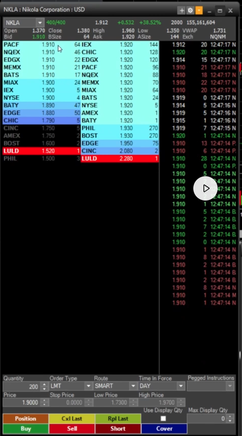

# Lecture du Level 2 — fiche de révision

> Le **carnet d'ordres niveau 2** affiche toutes les *limit orders* en attente sur chaque côté du *book*. Couplé au **Time & Sales** (les exécutions au fil de l'eau), il dit où va le cours **avant** que le chart bouge — utile pour timer l'entrée / la sortie sur un short.



---

## Les deux côtés du carnet

| Côté    | Rôle                                                      | Position UI    |
|---------|-----------------------------------------------------------|----------------|
| **BID** | Acheteurs en attente — le prix qu'ils acceptent de payer  | Colonne gauche |
| **ASK** | Vendeurs en attente — le prix qu'ils demandent            | Colonne droite |

> Le **spread** = écart entre le meilleur BID et le meilleur ASK. Plus il est large, plus le titre est illiquide.

---

## Size — détecter les bouchons

La colonne **Size** affiche le nombre de *shares* en attente à chaque niveau de prix.

- **Size normale** → flux ordinaire d'ordres limites.
- **Size énorme à un niveau** = **bouchon** (*wall*) → un gros porteur défend ce prix.

**Sur un short** : un bouchon côté BID = force acheteuse → **mauvais signal**. On évite, ou on réduit la taille — le cours va rebondir sur le mur au lieu de retomber. Inversement, un bouchon côté ASK qui ne fond pas valide la thèse short (les acheteurs n'arrivent pas à percer).

---

## Time & Sales — couleur des exécutions

À droite du *book*, le **Time & Sales** (T&S) liste toutes les transactions exécutées, du plus récent au plus ancien.

| Couleur  | Côté exécuté    | Mécanique                                | Pression  |
|----------|-----------------|------------------------------------------|-----------|
| 🟢 Vert  | Sur l'**ASK**   | L'acheteur a accepté le prix vendeur.    | Haussière |
| 🔴 Rouge | Sur le **BID**  | Le vendeur a accepté le prix acheteur.   | Baissière |
| ⚪ Blanc | Neutre          | Ordre *market* sans direction marquée.   | —         |

---

## Lecture du signal

- **Cascade de rouge** dans le T&S → le BID se fait éplucher → **le cours tombe**. Bon signal pour entrer sur un short ou laisser courir une position ouverte.
- **Cascade de vert** → l'ASK se fait lifter → **le cours monte**. Mauvais signal pour un short — on coupe ou on attend.
- **Vert qui rebondit sur un bouchon ASK** → tentative de push qui n'arrive pas à percer → opportunité court à l'horizon.

---

## Mémo de poche

```
BID   ← acheteurs (gauche)
ASK   → vendeurs (droite)
SIZE  bouchon = wall = force du côté, mauvais pour short si c'est le BID
T&S   vert  = sur ASK (up)
      rouge = sur BID (down)
      blanc = market (neutre)
```

**Cascade rouge → cours descend.** C'est la signature qu'on veut voir sur un short.

---

## À creuser

- **Iceberg** — un bouchon qui se reconstitue à chaque exécution = ordre caché, signal de défense forte.
- **Spoofing** — gros ordre BID/ASK affiché puis retiré juste avant exécution. Comment le repérer en live ?
- **T&S sur les gap ups** — à quel moment la cascade de rouge confirme le rejet du pattern n°2 (push puis retombe) ?
